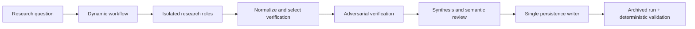

# Research Swarm for Claude Code

Research Swarm is a Claude Code dynamic workflow for people who need public-web research reported with traceable evidence, adversarial verification, and a machine-validatable archive.

- Keeps research orchestration in a JavaScript workflow and role instructions in project-local Claude Code assets.
- Preserves sources, claims, conflicts, coverage gaps, verification events, repairs, and report-to-claim anchors in each archived run.
- Uses deterministic Node.js validation so archive structure can be checked offline.

## Contents

- [Quickstart](#quickstart)
- [Features](#features)
- [Architecture](#architecture)
- [Directory structure](#directory-structure)
- [Usage](#usage)
- [Developer command center](#developer-command-center)
- [Testing & verification](#testing--verification)
- [Troubleshooting](#troubleshooting)
- [Stack inventory](#stack-inventory)
- [Reproducibility & maintenance](#reproducibility--maintenance)
- [Contributing and governance](#contributing-and-governance)
- [Roadmap](#roadmap)
- [License](#license)

## Quickstart

### Prerequisites

- Claude Code 2.1.154 or later with **Dynamic workflows** enabled in `/config`. This repository was last checked with Claude Code 2.1.220.
- Node.js with npm, for the offline contract and test commands.

### Install and verify

```sh
npm ci
npm run contracts:check
npm test
node scripts/validate-research-run.mjs tests/fixtures/valid-run-v2
```

The last command validates the included version-2 fixture. The repository records its most recent offline acceptance as 88 passing tests; run the commands yourself for your checkout.

### Run research

Open this repository in Claude Code, then invoke:

```text
/research-swarm What evidence supports and challenges the effectiveness of intervention X?
```

For bounded structured input:

```text
/research-swarm {"query":"Compare approaches A and B","depth":"deep","maxWorkers":6,"verification":"risk-based","learning":"adapt","freshness":"sources published since 2024","outputRoot":"artifacts/research-runs"}
```

New archives are written below `artifacts/research-runs/`.

## Features

- Depth-aware parallel research with hard resource limits and bounded focused gap filling.
- Adversarial verification, explicit conflicts and coverage gaps, and at most two targeted repair rounds.
- Versioned, auditable archives with deterministic contract validation and optional bounded learning controls.

## Architecture



The workflow owns fan-out, selection, bounded repairs, aggregation, and return values. Role documents provide behavioral instructions; canonical JSON Schemas and Node.js validation enforce archive contracts. See [the full workflow guide](research/README.md) for evidence standards, depth policy, archive layout, learning controls, and current runtime limitations.

## Directory structure

```text
.claude/       Claude Code workflow, role definitions, rules, commands, hooks, and skills
research/      Archive schemas and the detailed workflow operating guide
scripts/       Contract generation, archive validation/finalization, and learning utilities
tests/         Offline deterministic node:test coverage and archive fixtures
artifacts/     Ignored output roots for generated research archives and learning artifacts
docs/          Specification, progress record, and audit/remediation evidence
```

## Usage

Use `/research-swarm` for a public-web research question. Use `light` for narrow, low-consequence questions, `standard` for normal multi-source work, and `deep` when every admitted claim needs verification. Deep always verifies every admitted canonical claim.

## Developer command center

| Command | Use | Source |
| --- | --- | --- |
| `npm run contracts:generate` | Regenerate workflow contract artifacts from canonical schemas. | `package.json` |
| `npm run contracts:check` | Check generated contract artifacts for drift. | `package.json` |
| `npm test` | Run deterministic `node:test` coverage. | `package.json` |
| `node scripts/validate-research-run.mjs artifacts/research-runs/example-run` | Validate an archived run without changing it. | `research/README.md` |
| `node scripts/finalize-research-run.mjs artifacts/research-runs/example-run` | Finalize a supplied archive; only the persistence writer should invoke this in normal workflow operation. | `research/README.md` |

Claude Code commands for feedback, learning lifecycle operations, and review-only improvement proposals live in [`.claude/commands/`](.claude/commands/). The workflow entry point is [`.claude/workflows/research-swarm.js`](.claude/workflows/research-swarm.js).

## Configuration and safety

No required environment variables or safe environment example file are present. `CLAUDE_CODE_SUBAGENT_MODEL`, if set in the user environment, overrides the workflow's selective per-stage model routing; leave it unset to use the repository policy.

Project settings define a small workflow-size guideline and two local hooks:

| Event | Action | Purpose |
| --- | --- | --- |
| `SessionStart` | `.claude/hooks/session-start.sh` | Ensures locked research dependencies are usable, otherwise attempts local npm recovery. |
| `Stop` | `scripts/recover-research-learning.mjs` | Performs bounded learning-state recovery. |

Worker and verifier permissions are behavioral rather than hard per-call restrictions in the documented Dynamic Workflow interface. For sensitive research, use a narrow Claude Code session-level allowlist. Do not rely on a research report alone for consequential legal, medical, financial, safety, or other high-stakes decisions.

## Testing & verification

Run `npm run contracts:check` before `npm test`; both are deterministic and offline. Validate a known-good archive with `node scripts/validate-research-run.mjs tests/fixtures/valid-run-v2`. No CI workflow is present.

## Troubleshooting

| Symptom | Likely cause | Fix |
| --- | --- | --- |
| `/research-swarm` is unavailable | Dynamic workflows are not enabled or Claude Code is too old. | Enable **Dynamic workflows** in `/config` and use Claude Code 2.1.154 or later. |
| Workflow stops at a review gate | Claude Code requires explicit Dynamic Workflow review before execution. | Review and approve the workflow in Claude Code; the repository does not claim a completed runtime archive when that gate blocks execution. |
| Research roles cannot retrieve public sources | `WebSearch` or `WebFetch` is unavailable to the session. | Start Claude Code with those tools available for public-web research. |
| An archive fails validation | The archive is incomplete or violates a canonical contract. | Run `node scripts/validate-research-run.mjs artifacts/research-runs/example-run` and correct the reported structural error; do not hand-edit evidence to make validation pass. |
| Repeated identical queries collide | The current runtime rejects direct clock/random calls used for unique naming. | Use distinct safe `outputRoot` descendants until Claude Code documents a collision-safe primitive. |

## Stack inventory

- **Runtime workflow:** Claude Code Dynamic Workflows — version 2.1.154 or later required; 2.1.220 last checked ([source](research/README.md)).
- **Validation and tests:** Node.js built-ins and `node:test` — no Node.js version is declared ([sources](package.json)).
- **Schema enforcement:** Ajv 8.20.0 ([source](package.json)).
- **Package manager:** npm with a committed lockfile ([source](package-lock.json)).

## Reproducibility & maintenance

For a reproducible local check, start from a fresh clone and use `npm ci`, `npm run contracts:check`, and `npm test`. Regenerate contracts only when canonical schemas change, then re-run `npm run contracts:check`. Generated archive directories are ignored by Git. The `SessionStart` hook is intentionally quiet when dependencies are already usable.

## Contributing and governance

Read [CONTRIBUTING.md](CONTRIBUTING.md) before proposing changes, [CODE_OF_CONDUCT.md](CODE_OF_CONDUCT.md) before participating, and [SECURITY.md](SECURITY.md) to report a vulnerability safely. Open an issue before large changes and follow [AGENTS.md](AGENTS.md) for repository rules.

No license file was found. Add a license before publishing or accepting contributions.

The implementation roadmap and open runtime-acceptance limitations are recorded in [docs/research-swarm-progress.md](docs/research-swarm-progress.md). The architecture and canonical contracts are defined in [docs/research-swarm-spec.md](docs/research-swarm-spec.md).

## Roadmap

The current progress record identifies bounded current-runtime Light and Deep acceptance as incomplete. No further roadmap commitments are made here.

## License

No license file was found. Add a license before publishing or accepting contributions.
