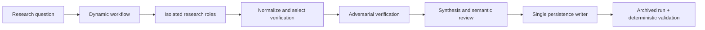

# Research Swarm for Claude Code

Research Swarm is a Claude Code dynamic workflow for people who need public-web research reported with traceable evidence, adversarial verification, and a machine-validatable archive.

- Keeps research orchestration in a JavaScript workflow and role instructions in project-local Claude Code assets.
- Preserves sources, claims, conflicts, coverage gaps, verification events, repairs, and report-to-claim anchors in each archived run.
- Uses deterministic Node.js validation so archive structure can be checked offline.
- Includes a read-only project profiler for target repositories; it records metadata-backed commands, capability evidence, and a drift fingerprint without creating a repository map.
- Includes a manual `/build` controller, disposable prototype lane, drift-aware task-capsule compiler, bounded executor, and independent verification plane; none merges or deploys.

## Contents

- [Quickstart](#quickstart)
- [Features](#features)
- [Architecture](#architecture)
- [Directory structure](#directory-structure)
- [Usage](#usage)
- [Developer command center](#developer-command-center)
- [Testing & verification](#testing--verification)
- [Troubleshooting](#troubleshooting)
- [Stack inventory](#stack-inventory)
- [Reproducibility & maintenance](#reproducibility--maintenance)
- [Contributing and governance](#contributing-and-governance)
- [Roadmap](#roadmap)
- [License](#license)

## Quickstart

### Prerequisites

- Claude Code 2.1.154 or later with **Dynamic workflows** enabled in `/config`. This repository was last checked with Claude Code 2.1.220.
- Node.js with npm, for the offline contract and test commands.

### Install and verify

```sh
npm ci
npm run contracts:check
npm test
node scripts/validate-research-run.mjs tests/fixtures/valid-run-v2
```

The last command validates the included version-2 fixture. The repository records its most recent offline acceptance as 103 passing tests; run the commands yourself for your checkout.

### Run research

Open this repository in Claude Code, then invoke:

```text
/research-swarm What evidence supports and challenges the effectiveness of intervention X?
```

For bounded structured input:

```text
/research-swarm {"query":"Compare approaches A and B","depth":"deep","maxWorkers":6,"verification":"risk-based","learning":"adapt","freshness":"sources published since 2024","outputRoot":"artifacts/research-runs"}
```

New archives are written below `artifacts/research-runs/`.

### Distribute to another repository

Distribution is hybrid: the Claude Code plugin carries generic guidance, while the installer bootstraps project-local workflow, schemas, scripts, and research roles because current plugin documentation does not include Dynamic Workflows.

```sh
node scripts/distribute.mjs install --target <absolute-target-directory>
node scripts/distribute.mjs status --target <absolute-target-directory>
node scripts/distribute.mjs update --target <absolute-target-directory>
node scripts/distribute.mjs rollback --target <absolute-target-directory>
node scripts/distribute.mjs uninstall --target <absolute-target-directory>
```

Add `--dry-run` to inspect a plan. Ownership and SHA-256 hashes live in `.research-swarm/distribution-manifest.json`; conflicts, symlinks, path escape, and user-modified owned files fail closed. Settings, hooks, archives, learning state, and other target data are never owned or removed.

## Features

- Depth-aware parallel research with hard resource limits and bounded focused gap filling.
- Adversarial verification, explicit conflicts and coverage gaps, and at most two targeted repair rounds.
- Versioned, auditable archives with deterministic contract validation and optional bounded learning controls.

## Architecture



The workflow owns fan-out, selection, bounded repairs, aggregation, and return values. Role documents provide behavioral instructions; canonical JSON Schemas and Node.js validation enforce archive contracts. See [the full workflow guide](research/README.md) for evidence standards, depth policy, archive layout, learning controls, and current runtime limitations. Use manual `/build` for interactive engineering routing: it inspects repository facts before asking questions, researches only material external facts, prototypes questions inspection cannot settle, and asks one high-value normative or consequential question when human judgment is required. It adds no executor or runtime surface.

## Directory structure

```text
.claude/       Claude Code workflow, role definitions, rules, commands, hooks, and skills
research/      Archive schemas and the detailed workflow operating guide
scripts/       Contract generation, archive validation/finalization, and learning utilities
tests/         Offline deterministic node:test coverage and archive fixtures
artifacts/     Ignored output roots for generated research archives and learning artifacts
docs/          Specification, progress record, and audit/remediation evidence
```

## Usage

Use `/research-swarm` for a public-web research question. Use `light` for narrow, low-consequence questions, `standard` for normal multi-source work, and `deep` when every admitted claim needs verification. Deep always verifies every admitted canonical claim.

## Developer command center

| Command | Use | Source |
| --- | --- | --- |
| `npm run contracts:generate` | Regenerate workflow contract artifacts from canonical schemas. | `package.json` |
| `npm run contracts:check` | Check generated contract artifacts for drift. | `package.json` |
| `npm test` | Run deterministic `node:test` coverage. | `package.json` |
| `npm run profile -- <absolute-target-directory>` | Emit a deterministic, schema-validated profile of a target project. | `scripts/profile-project.mjs` |
| `npm run evidence:packet -- <archive-directory> <packet-id> <engineering-question> <selection-rationale> <claim-id[,claim-id...]>` | Emit a scoped engineering evidence packet from a validated, confirmed research archive. | `scripts/compile-engineering-evidence-packet.mjs` |
| `node scripts/route-engineering-uncertainty.mjs <uncertainty.json>` | Validate and deterministically route one engineering uncertainty. | `scripts/route-engineering-uncertainty.mjs` |
| `node scripts/render-change-contract.mjs <contract.json> [--check-base <target-directory>]` | Validate and render a canonical Change Contract; optionally reject a drifted repository base. | `scripts/render-change-contract.mjs` |
| `node scripts/prototype-worktree.mjs <create\|cleanup> <experiment.json> <repository-root>` | Create or dispose a revision-checked disposable prototype worktree. | `scripts/prototype-worktree.mjs` |
| `npm run tasks:compile -- <contract.json> <task-drafts.json> <absolute-target-directory>` | Validate accepted intent, compile a dependency-aware task graph, and emit disposable minimal task capsules. | `scripts/compile-task-graph.mjs` |
| `npm run authorization:check -- <contract.json> <graph.json> <capsule.json> <absolute-target-directory>` | Classify pre-execution risk and emit only the activated production-profile controls; rejects stale, unresolved, or altered gates. | `scripts/authorize-task-execution.mjs` |
| `npm run delivery:handoff -- <delivery-manifest.json> <target-directory>` | Validate canonical delivery references and render a compact, drift-checked fresh-session handoff. | `scripts/render-delivery-handoff.mjs` |
| `node scripts/register-engineering-learning.mjs <evidence.json> <lesson.json>` | Register one explicitly classified delivery signal; synthetic and baseline evidence remain non-promoting. | `scripts/lib/engineering-learning.mjs` |
| `node scripts/engineering-learning-control.mjs status` | Inspect dormant engineering-learning state; `pause`, `review`, `rollback`, and final-acceptance `activate` are explicit controls. | `scripts/engineering-learning-control.mjs` |
| `node scripts/benchmark-engineering.mjs <run.json> [candidate-run.json]` | Validate/collect a safe engineering benchmark run or compare aligned runs without authorizing work. | `docs/engineering-benchmark.md` |
| `node scripts/validate-research-run.mjs artifacts/research-runs/example-run` | Validate an archived run without changing it. | `research/README.md` |
| `node scripts/finalize-research-run.mjs artifacts/research-runs/example-run` | Finalize a supplied archive; only the persistence writer should invoke this in normal workflow operation. | `research/README.md` |

Claude Code commands for feedback, learning lifecycle operations, and review-only improvement proposals live in [`.claude/commands/`](.claude/commands/). The manual [`.claude/skills/build/SKILL.md`](.claude/skills/build/SKILL.md) provides `/build` decision routing, [`.claude/skills/prototype-lane/SKILL.md`](.claude/skills/prototype-lane/SKILL.md) runs one bounded disposable experiment, and [`.claude/skills/delivery-handoff/SKILL.md`](.claude/skills/delivery-handoff/SKILL.md) resumes a validated delivery handoff; none implements production work.

## Configuration and safety

No required environment variables or safe environment example file are present. `CLAUDE_CODE_SUBAGENT_MODEL`, if set in the user environment, overrides the workflow's selective per-stage model routing; leave it unset to use the repository policy.

Project settings define a small workflow-size guideline and two local hooks:

| Event | Action | Purpose |
| --- | --- | --- |
| `SessionStart` | `.claude/hooks/session-start.sh` | Ensures locked research dependencies are usable, otherwise attempts local npm recovery. |
| `Stop` | `scripts/recover-research-learning.mjs` | Performs bounded learning-state recovery. |

Worker and verifier permissions are behavioral rather than hard per-call restrictions in the documented Dynamic Workflow interface. For sensitive research, use a narrow Claude Code session-level allowlist. Do not rely on a research report alone for consequential legal, medical, financial, safety, or other high-stakes decisions.

## Testing & verification

Run `npm run contracts:check` before `npm test`; both are deterministic and offline. Validate a known-good archive with `node scripts/validate-research-run.mjs tests/fixtures/valid-run-v2`. No CI workflow is present.

`npm run profile -- <absolute-target-directory>` reads project metadata and source files without installing dependencies or modifying the target. It reports only declared build/test/lint/typecheck/run commands, revision/dirty state when the target itself is a Git root, Claude Code configuration evidence, and explicit unknowns. Its fingerprint changes when profiled project content changes; regenerate a drifted profile before using it as engineering context. LSP and code-intelligence entries are optional configuration evidence, never a claim that a provider is runnable.

`/build` is manually invoked and does not implement code. It records material uncertainties for brownfield changes or a concise greenfield charter, routes repository facts to inspection, material external facts to Research Swarm/evidence packets, experiential or architecture uncertainty to a disposable prototype, and only normative, preference, policy, hard-to-reverse, or consequential decisions to one human question. Evidence never becomes a decision automatically.

A Change Contract is the durable Intent-plane JSON record after decisions exist: requirements link to their authorizing decisions, criteria describe observable proof, and the contract captures constraints, non-goals, risks, unresolved uncertainty, optional prototype evidence, and a profiled base revision/fingerprint. Its Markdown rendering is a view, not authority. A required experiential prototype question keeps the contract `draft`; its accepted, rejected, or inconclusive record is evidence only, and a separate explicit decision is still required. No lifecycle state authorizes task execution, accepted contracts reject execution-relevant unresolved uncertainty, and a changed profile invalidates the base context.

Prototype work uses an absolute, disposable Git worktree outside the production repository and records the exact base revision, bounded local instructions, observations, verdict, decision references, artifacts, and cleanup state. The helper refuses source drift and direct prototype-artifact promotion. Dispose it after recording the result; dirty worktrees are preserved for manual inspection rather than force-deleted.

Task graphs are derived from an accepted, current Change Contract plus explicit task drafts. Each task maps to observable criteria, names code anchors and verification, carries explicit dependencies, and rejects unordered anchor collisions. Broad migrations may use `expand`, `migrate`, and `contract` slices; reversed dependencies fail. Capsules include only the mapped criteria and decision evidence, non-goals, base revision, anchors, verification, risks, and stop conditions. They deliberately exclude the full contract, research archives, specifications, conversation history, and permanent repository maps; any revision, fingerprint, contract, or anchor drift fails closed and requires regeneration.

`/build` records deterministic risk classification and bounded authorization for the accepted current contract, task graph, capsule, and profile. Authentication/security, sensitive-data/integrity, migration, external-API, UI/accessibility, infrastructure, and dependency profiles activate only when their recorded risk dimension applies; each adds its relevant planning constraints and proof kinds, while low-risk tasks add none. The executor then rechecks that authorization immediately before creating an isolated worktree and returns immutable command/change events as **unverified implementation**. A separate fresh-context verifier receives the criterion/capsule, authorization posture, changed worktree, and change identity—but never executor reasoning—and records one terminal proof per criterion. It may request at most two identified-defect repairs, each re-verified from fresh context. Command evidence cannot satisfy a criterion requiring runtime, browser, API, LSP, security, or an activated profile's proof kind. Neither role commits, merges, pushes, or deploys.

A delivery manifest is a compact derived index over the accepted contract, profile, graph, capsule, authorization, immutable execution event, verifier events, and criterion proofs. `/delivery-handoff` validates every referenced file digest and current target fingerprint before rendering the decision, final diff identity, changed files, proofs, unresolved risks, repair history, integration state, and next action. It needs no prior conversation and fails closed on missing or stale records; it does not re-execute, approve, commit, push, merge, or deploy. Engineering learning consumes only a separately classified handoff: synthetic fixtures and the plain-Claude baseline are never live outcomes, and live activation waits for final Claude Code project acceptance.

For a new project, `npm run greenfield -- <plan.json> <absolute-target-directory>` validates the charter, evidence-linked stack decisions, subtraction ladder, accepted Change Contract, and safe relative file set, then scaffolds only the supplied first slice with native tooling. The generated target is profiled again and uses the same task graph, authorization, isolated executor, fresh verifier, and handoff path as brownfield work. Research remains conditional on the Decision Router; the builder never deploys.

## Troubleshooting

| Symptom | Likely cause | Fix |
| --- | --- | --- |
| `/research-swarm` is unavailable | Dynamic workflows are not enabled or Claude Code is too old. | Enable **Dynamic workflows** in `/config` and use Claude Code 2.1.154 or later. |
| Workflow stops at a review gate | Claude Code requires explicit Dynamic Workflow review before execution. | Review and approve the workflow in Claude Code; the repository does not claim a completed runtime archive when that gate blocks execution. |
| Research roles cannot retrieve public sources | `WebSearch` or `WebFetch` is unavailable to the session. | Start Claude Code with those tools available for public-web research. |
| An archive fails validation | The archive is incomplete or violates a canonical contract. | Run `node scripts/validate-research-run.mjs artifacts/research-runs/example-run` and correct the reported structural error; do not hand-edit evidence to make validation pass. |
| Repeated identical queries collide | The current runtime rejects direct clock/random calls used for unique naming. | Use distinct safe `outputRoot` descendants until Claude Code documents a collision-safe primitive. |

## Stack inventory

- **Runtime workflow:** Claude Code Dynamic Workflows — version 2.1.154 or later required; 2.1.220 last checked ([source](research/README.md)).
- **Validation and tests:** Node.js built-ins and `node:test` — no Node.js version is declared ([sources](package.json)).
- **Schema enforcement:** Ajv 8.20.0 ([source](package.json)).
- **Package manager:** npm with a committed lockfile ([source](package-lock.json)).

## Reproducibility & maintenance

For a reproducible local check, start from a fresh clone and use `npm ci`, `npm run contracts:check`, and `npm test`. Regenerate contracts only when canonical schemas change, then re-run `npm run contracts:check`. Generated archive directories are ignored by Git. The `SessionStart` hook is intentionally quiet when dependencies are already usable.

## Contributing and governance

Read [CONTRIBUTING.md](CONTRIBUTING.md) before proposing changes, [CODE_OF_CONDUCT.md](CODE_OF_CONDUCT.md) before participating, and [SECURITY.md](SECURITY.md) to report a vulnerability safely. Open an issue before large changes and follow [AGENTS.md](AGENTS.md) for repository rules.

No license file was found. Add a license before publishing or accepting contributions.

The forward-looking, outcome-led roadmap is [docs/ROADMAP.md](docs/ROADMAP.md). Implemented work and open runtime-acceptance limitations are recorded in [docs/research-swarm-progress.md](docs/research-swarm-progress.md). Research architecture and canonical contracts are defined in [docs/research-swarm-spec.md](docs/research-swarm-spec.md); engineering-system boundaries are defined in [docs/engineering-constitution.md](docs/engineering-constitution.md).

## Roadmap

Current-runtime Light and Deep acceptance, risk authorization with conditional production profiles, the plain-Claude engineering baseline harness, bounded executor, independent verification, and delivery handoff are complete. No executor value claim is allowed until Milestone 64 compares it against the recorded baseline.

## License

No license file was found. Add a license before publishing or accepting contributions.
